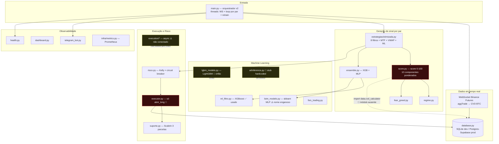

# 🗺️ Relatório de Mapeamento, Diagnóstico e Plano de Melhorias — BinanceXBot

> **Data:** 2026-06-20 · **Escopo:** repositório completo (59 arquivos `.py` + infra) · **Branch:** `claude/zealous-noyce-0d02b9`
> **Método:** exploração paralela por subsistema (ML, execução/risco, dados/infra, estratégias/CI) + **verificação direta no código** dos achados críticos (grep + leitura + smoke test de import).

---

## 1. Sumário Executivo

| Veredicto | Status |
|-----------|--------|
| **O bot inicia a partir de um clone limpo do repositório?** | 🔴 **NÃO** — `import` da estratégia falha (`ModuleNotFoundError: No module named 'data'`). Provado abaixo. |
| **A suíte de testes passa num checkout limpo?** | 🔴 **NÃO** — mesma cadeia de import quebrada (`tests/test_integration.py` e backtesting importam `score`). |
| **Há risco de vazamento de segredos no código versionado?** | 🟢 **Baixo** — sem credenciais hardcoded, `.env*` ignorados, `detect-secrets` no pre-commit. |
| **O desenho de gestão de risco é sólido?** | 🟢 **Sim** — Kelly fracionado, circuit breaker, drawdown diário/total, paper trading por padrão. |
| **A arquitetura está coerente?** | 🟡 **Não** — projeto em meio a migração GCP→Railway/Supabase, com 3 pares de camadas duplicadas (sync vs async) e código órfão. |

**Conclusão de uma linha:** o projeto tem fundação conceitual boa (risco, estratégia multi-filtro, observabilidade), mas **está quebrado para deploy** por dois defeitos verificados e carrega dívida técnica de uma migração inacabada. Os bloqueadores são pequenos de corrigir.

---

## 2. Mapa do Sistema



### Inventário por subsistema

| Subsistema | Arquivos-chave | Estado | Observação |
|-----------|----------------|--------|-----------|
| Orquestração | `main.py` | 🟡 funcional* | Threads por par; *não inicia por import quebrado |
| Estratégia | `estrategias/otimizada.py` | 🟡 | 8 filtros + score; gera VENDA mas nunca é executada |
| Score | `score.py` | 🔴 | `_score_regime` indefinido + import `data` ausente |
| Regime | `regime.py` | 🟡 | Busca 1D e descarta no voto |
| ML principal | `ml_filtro.py` (XGBoost) | 🟢 | É o modelo realmente usado |
| ML "LSTM" | `lstm_modelo.py` (sklearn MLP) | 🟡 | Não é LSTM; ~517 features → overfitting |
| ML LightGBM | `lgbm_modelo.py` | 🔴 | Órfão; `lightgbm` nem está no `requirements.txt` |
| ML async | `ai/inference.py` | 🔴 | Stub: predições hardcoded `[0.2,0.6,0.2]` |
| Execução | `executor.py` | 🟡 | Só `abrir_long`; sem lock; sem retry REST |
| Risco | `risco.py` | 🟢 | Kelly+CB+drawdown; bom desenho |
| Dados | `database.py` (+ `infra/database.py` async órfão) | 🟡 | Dupla implementação |
| Execução async | `execution/order_manager.py`, `signal_executor.py` | 🔴 órfão | Não conectado ao `main` |
| Infra/Deploy | `terraform/`, `cloudbuild.yaml`, `railway.toml`, `Procfile` | 🟡 | GCP (legado) **e** Railway/Supabase (novo) coexistindo |
| Testes/CI | `tests/`, `.github/workflows/` | 🟡 | Existem, mas não passam de clone limpo; deploy sem gate de teste |

---

## 3. Achados Críticos (🔴 — verificados no código)

### C-1 — O bot não inicia a partir do repositório (SHOWSTOPPER) ✅ provado
`score.py:33` faz `from data.cvd_calculator import calculate_cvd`, mas a pasta `data/` está **inteira no `.gitignore`** (`.gitignore:5 → data/`) e **nenhum** `cvd_calculator.py` existe no repositório (`git ls-files` não retorna nada sob `data/`). Como `main.py:39` importa `estrategias.otimizada`, que importa `score`, a cadeia inteira quebra. Smoke test executado:

```text
$ python -c "import estrategias.otimizada"
  File ".../score.py", line 33, in <module>
    from data.cvd_calculator import calculate_cvd
ModuleNotFoundError: No module named 'data'
```

**Impacto:** clone limpo, build Docker, CI e qualquer deploy novo falham na inicialização. Funciona na máquina do dev apenas porque há um `data/cvd_calculator.py` **não versionado** localmente.
**Correção:** mover o código-fonte de `cvd_calculator` para um pacote versionado (ex.: `core/` ou `infra/`) **ou** ajustar `.gitignore` para ignorar só artefatos (`data/*.db`, `data/*.pkl`, `data/*.json`) e versionar o `.py`. Adicionar smoke test `python -c "import main"` no CI.

### C-2 — `score.calcular()` chama função inexistente `_score_regime` ✅ provado
`score.py:250` usa `_score_regime(regime_info)`, mas **não existe** `def _score_regime` (todos os outros 9 helpers `_score_*` existem — confirmado por grep). A chamada `sc.calcular(...)` está no caminho quente (`estrategias/otimizada.py:129`) **sem try/except próprio**; a exceção sobe até o `except` genérico de `loop_par` (`main.py:409`), que apenas imprime o erro. **Resultado: nenhum sinal/trade jamais é gerado** — falha silenciosa a cada ciclo.
**Correção (trivial):** `regime_info` (de `regime.detectar()`) já traz `score` 0-100 e `regime_final`; implementar `_score_regime` mapeando esses campos.

### C-3 — Sinais de VENDA (short) são gerados, validados e descartados ✅ provado
`estrategias/otimizada.py:160-173` calcula `filtros_short` e emite `sinal="VENDA"`. Em `main.py:358` a venda passa por `validar_trade` e até pela lógica de Scale-In, mas em `main.py:400-401` **só** `abrir_long` é chamado — `executor.py` **não tem** `abrir_short`. A venda é silenciosamente ignorada após consumir o pipeline.
**Impacto:** metade da estratégia (tendência de baixa) é trabalho morto; comportamento inconsistente e confuso em auditoria.
**Correção:** implementar `abrir_short` no `Executor` **ou** desabilitar explicitamente a geração de `VENDA` até haver suporte real.

### C-4 — `ai/inference.py` retorna predições fixas (não usa o modelo) ✅ provado
`ai/inference.py:153` e `:170` retornam `np.array([0.2,0.6,0.2])` / `[0.3,0.4,0.3]` ignorando o `feature_vector`; `:141` usa `asyncio.get_event_loop().time()` (uso incorreto → erro em runtime). O módulo é importado apenas por testes (`test_phase22.py`, `tests/test_ai.py`), **não pelo loop principal** — é um stub da "fase 2.2" que nunca foi finalizado.
**Risco:** induz a crer que há inferência async funcional. Testes passam por validarem o stub, não o modelo.
**Correção:** finalizar (carregar modelo real) ou mover para `_legado/`.

### C-5 — `lgbm_modelo.py` (LightGBM) é órfão e quebraria se chamado ✅ provado
`lgbm_modelo.py:78` faz `import lightgbm`, mas **`lightgbm` não está no `requirements.txt`**. Nenhum módulo de produção importa `lgbm_modelo` (ensemble/retrain usam `ml_filtro`=XGBoost e `lstm_modelo`=MLP). É código não conectado que falharia com `ModuleNotFoundError` se acionado via `python lgbm_modelo.py`.
**Correção:** aposentar (`_legado/`) ou, se for o futuro do projeto, adicionar a dependência e ligá-lo ao ensemble.

---

## 4. Achados de severidade média (🟡)

| ID | Local | Problema | Correção sugerida |
|----|-------|----------|-------------------|
| M-1 | `regime.py:180`, `ensemble.py:180` | 1D é calculado (`_klines("1d")`) mas **descartado** no voto: `regimes = [1h, 4h, 4h]`. Custa uma chamada de API e contradiz a docstring "3 timeframes". | Incluir 1D: `[1h, 4h, 4h, 1d]` (mantendo peso duplo de 4H, se intencional). |
| M-2 | `executor.py` (`_monitorar` vs `fechar_posicao`) | Race condition: thread de monitor lê `self.posicao` enquanto a main pode setar `None`. | `threading.Lock` em torno do estado da posição. |
| M-3 | `executor.py`, `risco.py` (chamadas REST) | Sem retry/backoff nem tratamento de HTTP 429; `r.json()` sem validar `code`/`status`. | `requests.Session` + retry (tenacity); validar resposta da Binance. |
| M-4 | `lstm_modelo.py` | ~517 features (24 velas × 11 + deltas) para MLP 128→64→32 → forte risco de overfitting; nome "LSTM" enganoso (sklearn MLP). | Reduzir dimensionalidade / renomear honestamente. |
| M-5 | `ml_filtro.py`, `lgbm_modelo.py` | Features `var_1/var_4/var_24` usam fechamentos futuros; sem validação de borda no loop → possível **data leakage** no fim da série. | Garantir janela causal; validar tamanho do vetor de features. |
| M-6 | `logger.py:258` | `f"SELECT * FROM {tabela}"` com `tabela` vindo de argumento → SQL injection latente. | Whitelist de tabelas permitidas. |
| M-7 | Deploy | GCP (Terraform + `deploy.yml` + `cloudbuild.yaml`, trading **real**) coexiste com Railway/Supabase (`railway.toml`/`Procfile`, **paper**). `CLAUDE.md` ainda descreve GCP+Secret Manager. | Escolher alvo canônico; arquivar o outro (`@Zeta`); atualizar docs. |
| M-8 | `.github/workflows/deploy.yml` | Deploy dispara em push para `main` **sem gate** de testes (`needs:`). | `needs: [lint, test]` antes do deploy. |
| M-9 | `fear_greed.py`, `ai/ollama_client.py` | Caches globais sem timeout/thread-safety; fallback silencioso (FG=50) sem alerta. | Cache com TTL + lock; logar degradação. |
| M-10 | Camadas duplicadas | `database.py` (sync, usado) vs `infra/database.py` (async, órfão); `executor.py` vs `execution/*` async. | Consolidar numa arquitetura; mover a não usada para `_legado/`. |

---

## 5. Pontos fortes (🟢 — preservar)

- **Gestão de risco** (`risco.py`): Kelly fracionado (0.25), drawdown diário 5% / total 15%, circuit breaker persistido em DB (sobrevive a restart no Railway), volatilidade máx., 1 posição por vez.
- **Segurança de segredos**: sem hardcode; `API_KEY/SECRET` via env/`config/settings.py` (ignorado); `.env*` no `.gitignore`; `detect-secrets`, `bandit`, `mypy`, `black/isort/flake8` no pre-commit/CI.
- **Segurança operacional**: paper trading é o **default**; `--real` exige `ALLOW_REAL_TRADING=true` (defesa em profundidade).
- **Backtesting** (`backtesting/motor.py`): sem look-ahead bias, com taxas (0.04%) e slippage (0.05%).
- **Observabilidade**: logging JSON estruturado, Prometheus, dashboard, Telegram, `/health`.
- **WebSocket resiliente**: backoff exponencial com jitter, dedupe por `trade_id`.

---

## 6. Plano de Melhorias Priorizado

Formato: **P0** = desbloqueio/produção · **P1** = correção funcional · **P2** = dívida técnica.
Esforço: ⏱️ pequeno (<1h) · ⏱️⏱️ médio (meio dia) · ⏱️⏱️⏱️ grande.

### 🔴 P0 — Tornar o repositório executável (bloqueadores)
1. **Corrigir o módulo `data` ausente** (C-1) — versionar `cvd_calculator.py` (mover p/ `core/`/`infra/` ou refinar `.gitignore`). ⏱️
2. **Implementar `_score_regime`** em `score.py` (C-2) — mapear `regime_info["score"]/regime_final` → 0-100. ⏱️
3. **Smoke test de import no CI** — `python -c "import main"` como primeiro passo, impedindo regressão dos itens 1-2. ⏱️
4. **Rodar `pytest tests/ -v`** após 1-3 e validar suíte verde. ⏱️

### 🟡 P1 — Coerência funcional do trading
5. **Decidir sobre SHORT** (C-3): implementar `abrir_short` **ou** desligar geração de `VENDA`. ⏱️⏱️
6. **Voto de regime com 1D** (M-1) em `regime.py` e `ensemble.py`. ⏱️
7. **Lock no `Executor`** (M-2) — eliminar race condition do trailing stop. ⏱️
8. **Resiliência REST Binance** (M-3) — retry/backoff + validação de resposta + 429. ⏱️⏱️
9. **Resolver LightGBM** (C-5): adicionar ao `requirements.txt` e ligar ao ensemble, ou aposentar. ⏱️

### 🟢 P2 — Dívida técnica e clareza
10. **Aposentar código órfão** (`@Zeta`): `ai/inference.py` (stub), `execution/*` async, `infra/database.py` async → `_legado/` com `LEIA-ME.md` e plano de rollback. ⏱️⏱️
11. **Whitelist em `logger.exportar_csv`** (M-6). ⏱️
12. **Decisão de deploy** (M-7/M-8): canonizar Railway/Supabase **ou** GCP; arquivar o outro; `needs:` no `deploy.yml`; atualizar `CLAUDE.md`. ⏱️⏱️
13. **Alinhar documentação à realidade**: docs dizem "LightGBM + LSTM"; o código usa **XGBoost + sklearn MLP**. Corrigir `CLAUDE.md` e `RELATORIO_IA_MODELOS.md`. ⏱️
14. **Cache com TTL/lock** em `fear_greed`/`ollama_client` (M-9). ⏱️
15. **Revisar data leakage / overfitting** dos modelos (M-4/M-5) com validação walk-forward honesta. ⏱️⏱️⏱️

### Scorecard por dimensão (estado atual)
| Dimensão | Nota | Justificativa |
|----------|------|---------------|
| Executabilidade (clone→run) | 🔴 Baixa | Quebra no import (C-1, C-2) |
| Corretude funcional | 🔴 Baixa | Sinal nunca gerado; short descartado |
| Gestão de risco (design) | 🟢 Alta | Kelly + CB + drawdown + paper default |
| Segurança de segredos | 🟢 Alta | Sem hardcode; ferramentas no CI |
| Qualidade ML/IA | 🔴 Baixa | Stub hardcoded, órfãos, naming enganoso |
| Testes & CI | 🟡 Média | Existem, mas não passam limpo; deploy sem gate |
| Infra & Deploy | 🟡 Média | Migração GCP→Railway inacabada |
| Observabilidade | 🟢 Alta | Logs JSON, Prometheus, dashboard, Telegram |

---

## 7. Sequência recomendada de execução

```
P0 (itens 1-4)  →  valida: import OK + pytest verde   ← desbloqueia tudo
P1 (itens 5-9)  →  valida: backtest + paper trading    ← trading coerente
P2 (itens 10-15)→  valida: bandit clean + docs alinhadas ← reduz dívida
```

---

## 8. Status de Execução (2026-06-20)

### ✅ Aplicado e validado (`import main` OK · `pytest` 68 passed, 6 skipped)

| Item | O que foi feito | Arquivos |
|------|-----------------|----------|
| **P0-1** (C-1) | Versionado o pacote `data/` (cvd_calculator, stream_processor, `__init__`); `.gitignore` ajustado para ignorar só artefatos | `data/*`, `.gitignore` |
| **P0-2** (C-2) | `_score_regime` implementado reaproveitando a força de tendência de `regime.detectar()` | `score.py` |
| **P0-3** | Smoke test de imports no CI antes do pytest | `.github/workflows/ci.yml` |
| **P0-4** | Suíte verde; corrigido teste do Ollama que fazia rede em tempo de coleta | `tests/test_melhorias.py` |
| **P1-6** (M-1) | Voto de regime agora inclui 1D (mantendo peso duplo do 4H) | `regime.py` |
| **P1-7** (M-2) | `threading.Lock` protegendo o estado da posição no `Executor` | `executor.py` |
| **P1-8** (M-3) | Validação de resposta da Binance + **fix de segurança**: `fechar_posicao` não marca posição como fechada se a ordem real não preencher | `executor.py` |
| **C-3** | Sinal VENDA (short) deixou de consumir validação/scale-in/Telegram e ser descartado; agora é ignorado explicitamente | `main.py` |
| **P2-11** (M-6) | Whitelist de tabelas em `logger.exportar_csv` (elimina SQL injection latente) | `logger.py` |
| **P2-13** | Documentação alinhada à realidade (XGBoost + sklearn MLP; LightGBM órfão) | `CLAUDE.md` |

> **Correção de diagnóstico:** o achado "`ensemble.py:180` tem voto duplicado" **não se confirmou** — apenas `regime.py:180` tinha o padrão. Verificado por grep antes de corrigir.

### ⏳ Deliberadamente adiado (mudança estrutural / precisa de decisão)

| Item | Por quê | Recomendação |
|------|---------|--------------|
| **C-5 / P2-9** — LightGBM órfão | Adicionar ao ensemble exige treino/validação; mover para `_legado/` é seguro mas é decisão de produto | Aposentar via `@Zeta` (`_legado/`) ou integrar com backtest |
| **P2-10** — Aposentar `ai/inference.py` (stub), `execution/*` async, `infra/database.py` async | São importados por testes; mover quebra a suíte verde → exige PR dedicado com atualização dos testes e `LEIA-ME.md` de rollback | PR próprio (`@Zeta`) |
| **C-4** — Finalizar inferência async real | Mesmo bloco do P2-10 | Junto com a decisão de arquitetura |
| **M-4/M-5** — Data leakage / overfitting ML | Requer revalidação walk-forward dos modelos | `@Sigma` em ciclo dedicado |
| **Implementar SHORT real** | `abrir_short` toca execução de capital real; precisa de teste e sign-off | Backlog, com paper trading extenso antes |

### ⚠️ Achado novo (durante a execução)
- **Testes async no-op**: vários métodos `async def` em `tests/test_integration.py` rodam em `unittest.TestCase` sem await (warnings `coroutine was never awaited`) → passam sem testar nada. Migrar para `pytest-asyncio` (`@pytest.mark.asyncio`). Não bloqueia, mas infla a cobertura aparente.
