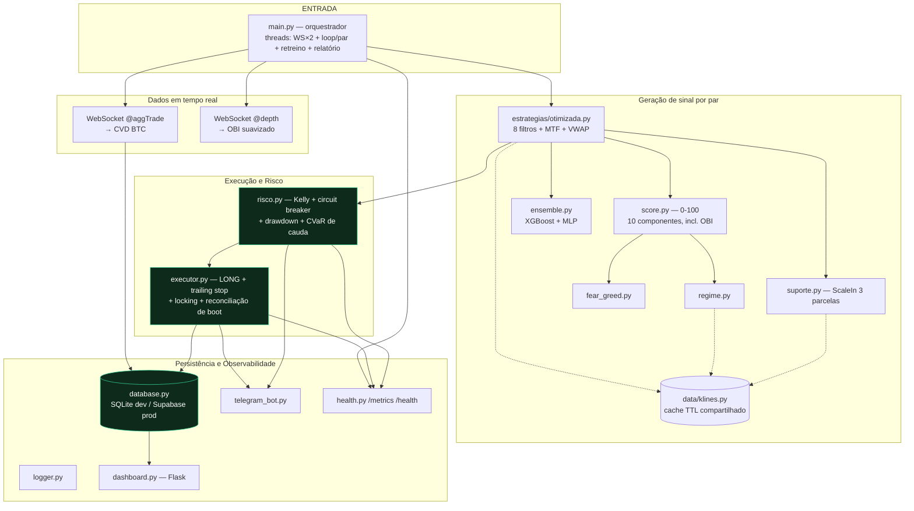

# 🏛️ Visão Geral da Arquitetura

> Voltar: [[00 - Home]] · Relacionado: [[Fluxo de Execucao]]

## Princípio
Arquitetura **síncrona com threads** (uma thread por par + duas para
WebSocket — `@aggTrade`/CVD e `@depth`/OBI — + uma para retreino semanal +
uma para relatório diário). A alternativa async ("fase 2") foi **aposentada
e removida do repo** (o histórico git preserva) — hoje existe **uma única
arquitetura**.

Mercado: **Binance Spot** (execução via `/api/v3/order`, maker-first via
`LIMIT_MAKER`, proteção via `STOP_LOSS_LIMIT` ou bracket OCO nativo
opt-in). Futures (`fapi.binance.com`) é lido **apenas** para funding rate /
open interest como sentimento — não é o mercado de execução.

## Diagrama

## Camadas e notas
- **Orquestração** → [[Core e Execucao]]
- **Sinal / ML** → [[ML e Sinais]]
- **Persistência / observabilidade** → [[Dados e Infra]]
- **Validação histórica** → [[Estrategias e Backtesting]]
- **Operação** → [[Deploy Supabase]], [[Deploy VPS]]

## Decisões arquiteturais relevantes
1. **Long-only** hoje: a estratégia gera sinais de VENDA, mas o `executor` só
   abre LONG; a VENDA é ignorada explicitamente (ver [[Core e Execucao]]).
2. **Dois backends de dados** via a mesma fachada `database.py` (SQLite local,
   Postgres/Supabase em produção) — ver [[Dados e Infra]].
3. **Paper trading é o padrão** (`DRY_RUN=true`); ordens reais exigem
   `ALLOW_REAL_TRADING=true` **e** a flag `--real` na linha de comando
   (defesa em profundidade — o `.env` sozinho não basta).
4. **Deploy como serviço 24/7**: Windows NSSM (PC) ou systemd na VPS
   (`deploy/`) + Supabase. Docker/Railway/GCP foram removidos do repo
   (ver [[Deploy VPS]]).
5. **Proteção pós-entrada em camadas**: `STOP_LOSS_LIMIT` puro por padrão
   (sobrevive a crash do bot); bracket OCO nativo (stop+alvo atômico) e
   trailing server-side são opt-in (`OCO_BRACKET`/`OCO_TRAILING_DELTA_BIPS`)
   — ativar só após validar em paper. O `executor.py` usa `RLock` (não
   `Lock`) porque `fechar_posicao`/`_aplicar_novo_stop` podem ser chamados
   de dentro do próprio monitor, que já segura o lock.
6. **Reconciliação de boot é opt-in** (`RECONCILIAR_BOOT_EXCHANGE`): por
   padrão, um restart confia cegamente no que está persistido no banco;
   ligada, cruza com o estado real da Binance (saldo/ordens abertas/
   histórico de trades) antes de religar o monitor — detecta posição órfã
   ou já fechada fora do bot.
