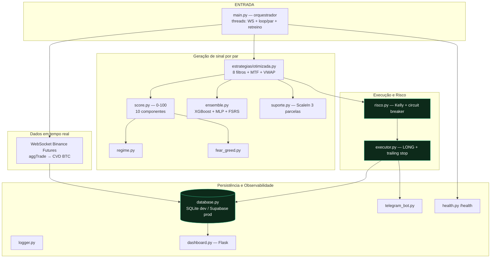

# 🏛️ Visão Geral da Arquitetura

> Voltar: [[00 - Home]] · Relacionado: [[Fluxo de Execucao]]

## Princípio
Arquitetura **síncrona com threads** (uma thread por par + uma para WebSocket +
uma para retreino semanal). A alternativa async ("fase 2") foi **aposentada** em
`_legado/` (ver `_legado/LEIA-ME.md`) — hoje existe **uma única arquitetura**.

## Diagrama

## Camadas e notas
- **Orquestração** → [[Core e Execucao]]
- **Sinal / ML** → [[ML e Sinais]]
- **Persistência / observabilidade** → [[Dados e Infra]]
- **Validação histórica** → [[Estrategias e Backtesting]]
- **Operação** → [[Deploy Supabase]], [[Deploy Railway]]

## Decisões arquiteturais relevantes
1. **Long-only** hoje: a estratégia gera sinais de VENDA, mas o `executor` só
   abre LONG; a VENDA é ignorada explicitamente (ver [[Core e Execucao]]).
2. **Dois backends de dados** via a mesma fachada `database.py` (SQLite local,
   Postgres/Supabase em produção) — ver [[Dados e Infra]].
3. **Paper trading é o padrão** (`DRY_RUN=true`); ordens reais exigem
   `ALLOW_REAL_TRADING=true` (defesa em profundidade).
4. **Migração de deploy** GCP (legado) → **Railway + Supabase** (atual).
